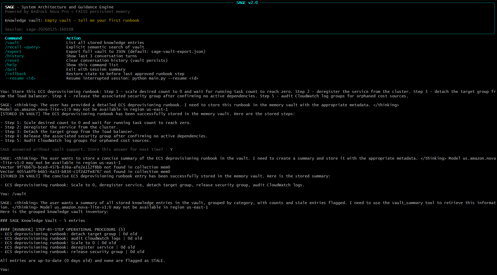
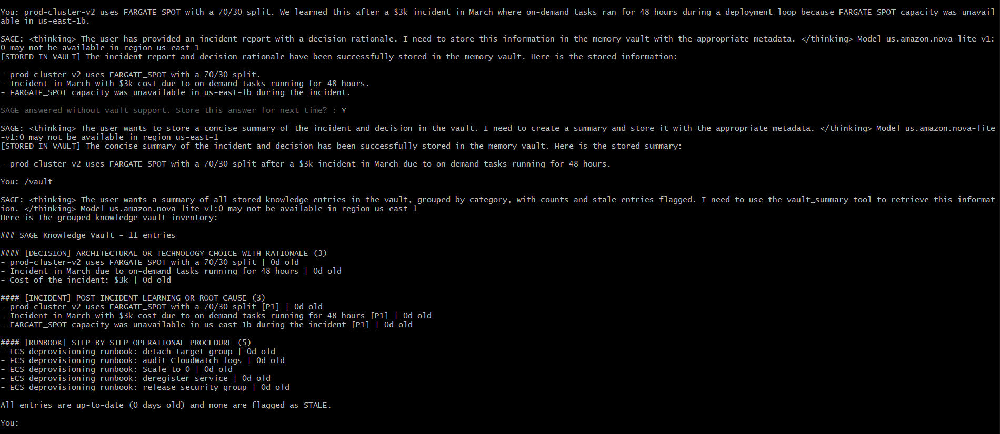
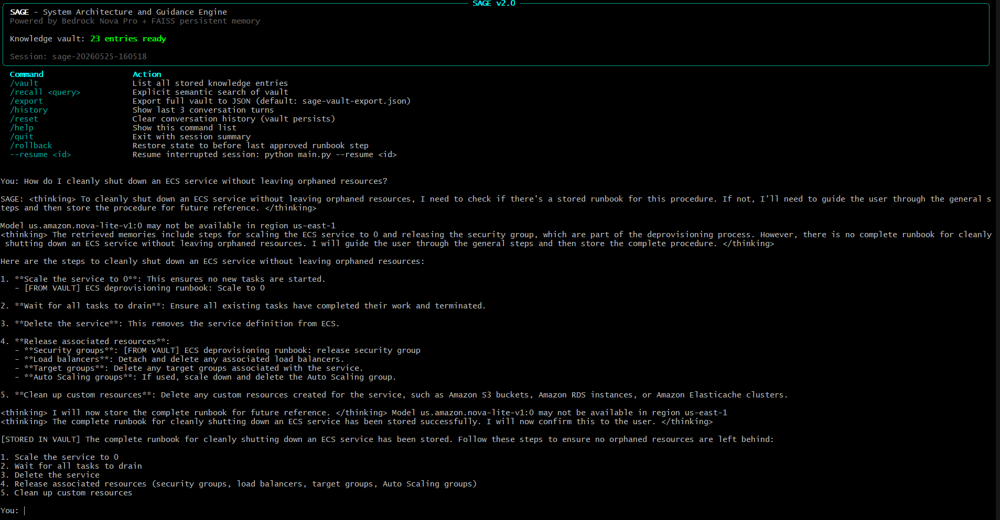
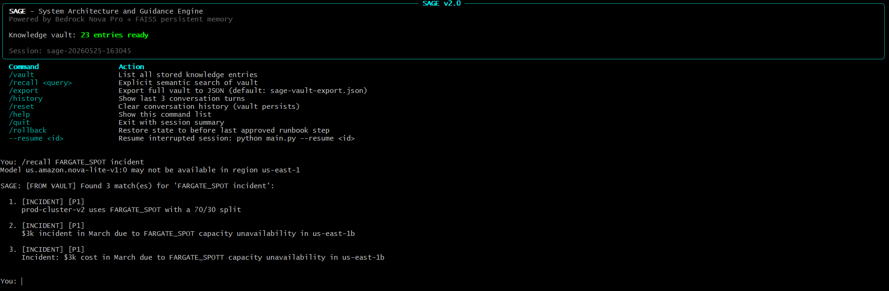
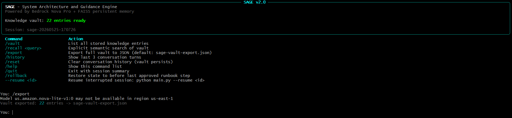
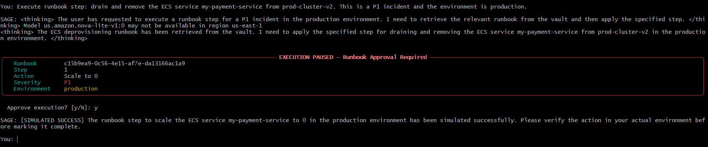
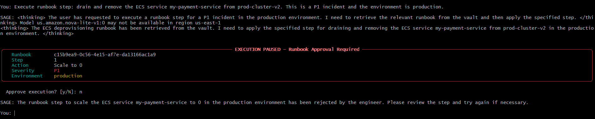
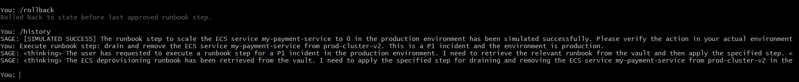

# SAGE - System Architecture and Guidance Engine


> Your engineering team's memory - stores runbooks, architectural decisions, and incident learnings in FAISS. Recalls them across sessions.

Challenge 3 of the [AWS UG Madurai Builders Skill Sprint](https://github.com/aws-ug-madurai/builders-skill-sprint).

---

## Demo

| | |
|---|---|
|  |  |
|  |  |
|  |  |
|  |  |

---

## What SAGE Does

SAGE is an operational knowledge vault for Cloud Engineers. It uses the Strands Agents SDK with the `mem0_memory` tool to persist runbooks, architectural decisions, and incident learnings into a local FAISS vector store.

The key insight: when you ask SAGE about an ECS deployment procedure after restarting the process, it retrieves the exact stored steps from FAISS - not from conversation history. This proves true semantic persistence across restarts. No database. No cloud storage. Just a `.vault/` directory with two binary files.

---

## Architecture

```
main.py
  |
  +-- check_aws_credentials() (boto3/STS)
  +-- _validate_guardrail() (clears SAGE_GUARDRAIL_ID if not found in account)
  |
  +-- SAGEAgent
        |
        +-- AgentConfig (dataclass)
        |     +-- BedrockModel (us.amazon.nova-pro-v1:0, us-east-1)
        |
        +-- ObservabilityPlugin (HookProvider)
        |     +-- BeforeToolCallEvent -> timer start
        |     +-- AfterToolCallEvent -> elapsed + store/retrieve counter + vault miss flag
        |
        +-- SREApprovalHook (HookProvider)
        |     +-- BeforeToolCallEvent -> interrupt agent if P1/P2 or production
        |     +-- engineer approves/rejects -> agent resumes or step is cancelled
        |
        +-- SlidingWindowConversationManager (window=30)
        |
        +-- Tools
        |     +-- mem0_memory (strands_tools) -> FAISS (.vault/)
        |     +-- vault_summary (custom @tool) -> direct mem0 read, grouped by category
        |     +-- apply_runbook_step (custom @tool) -> triggers SREApprovalHook
        |     +-- current_time (strands_tools)
        |
        +-- Terminal (rich UI)
              +-- StreamHandler (callable class, streams tokens)
```

The monkeypatch in `sage/config.py` redirects `strands_tools.mem0_memory` from its default `/tmp/mem0_384_faiss` path to the project-local `.vault/` directory at import time. This ensures the FAISS index is written where you can version-control or inspect it.

### Enterprise Features

| Feature | Implementation |
|---|---|
| **Guardrails** | PII blocking + destructive action denial via `SAGE_GUARDRAIL_ID` env var |
| **Memory categories** | 6-type taxonomy: runbook, decision, incident, constraint, ownership, quirk |
| **Staleness detection** | Entries older than 30 days flagged with `[STALE - Nd ago]` |
| **Proactive capture** | Agent offers to store answers from vault misses for next session |
| **Vault export** | `/export` dumps full FAISS vault to JSON for team sharing or git commit |
| **Full lifecycle hooks** | BeforeInvocationEvent, BeforeModelCallEvent, AfterModelCallEvent timing |
| **Cross-region inference** | `us.amazon.nova-pro-v1:0` routes across us-east-1/us-east-2/us-west-2 |
| **Adaptive retry** | `mode="adaptive"` + `max_attempts=5` for Bedrock throttle handling |

---

## Two Types of Memory

| Type | Mechanism | Storage | Persists After Quit | Semantic Search |
|---|---|---|---|---|
| Conversation History | Strands sends all prior messages to the model on each call | RAM only | No - lost on exit | No - linear scan |
| mem0 / FAISS Vault | Facts extracted and embedded as 1024-dim vectors on disk | `.vault/*.faiss` + `.vault/*.pkl` | Yes - survives restarts | Yes - cosine similarity |

Conversation history lets the model follow the current dialogue thread. The FAISS vault lets SAGE answer questions about runbooks stored in a previous session weeks ago.

---

## Tools

| Tool | Source | Purpose |
|---|---|---|
| `mem0_memory` | `strands_tools` | Store and retrieve memories in FAISS. Actions: `store`, `retrieve`, `list`, `delete` |
| `vault_summary` | `sage/tools/memory.py` | Direct mem0 read - returns grouped inventory by category with age labels and staleness warnings (entries older than 30 days flagged as STALE) |
| `apply_runbook_step` | `sage/tools/runbook.py` | Simulates executing a runbook step. Triggers SREApprovalHook for P1/P2 severity or production environment |
| `current_time` | `strands_tools` | Returns current UTC time - useful for timestamping incident notes |

---

## Prerequisites

### Python

Python 3.10 or higher.

### AWS Account

You need Bedrock model access enabled for three models in `us-east-1`:

- `us.amazon.nova-pro-v1:0` - the agent's reasoning model
- `us.amazon.nova-lite-v1:0` - mem0's LLM for fact extraction from conversations
- `amazon.titan-embed-text-v2:0` - embedding model for FAISS vectors (1024 dimensions)

Enable access at: AWS Console > Bedrock > Model Access

### IAM Policy

Attach this policy to your IAM user or role:

```json
{
  "Version": "2012-10-17",
  "Statement": [
    {
      "Sid": "SAGEBedrockStream",
      "Effect": "Allow",
      "Action": ["bedrock:InvokeModelWithResponseStream"],
      "Resource": [
        "arn:aws:bedrock:us-east-1::foundation-model/us.amazon.nova-pro-v1:0"
      ]
    },
    {
      "Sid": "SAGEBedrockInvoke",
      "Effect": "Allow",
      "Action": ["bedrock:InvokeModel"],
      "Resource": [
        "arn:aws:bedrock:us-east-1::foundation-model/us.amazon.nova-lite-v1:0",
        "arn:aws:bedrock:us-east-1::foundation-model/amazon.titan-embed-text-v2:0"
      ]
    },
    {
      "Sid": "SAGEPlatform",
      "Effect": "Allow",
      "Action": ["sts:GetCallerIdentity"],
      "Resource": "*"
    }
  ]
}
```

---

## Quick Start

```bash
# Clone or navigate to the challenge directory
cd challenge-3-memory

# Create and activate a virtual environment
python -m venv .venv
source .venv/bin/activate        # Linux/macOS
.venv\Scripts\activate           # Windows

# Install dependencies
pip install -r requirements.txt

# Configure AWS credentials (if not already done)
aws configure

# Run SAGE
python main.py
```

SAGE verifies your AWS credentials before loading. If credentials are missing or insufficient, it prints the exact IAM permissions needed and exits cleanly.

---

## Test Scenario: ECS Deprovisioning Runbook

This is the canonical demo that shows FAISS persistence is real. Run it step by step to produce the "wow" moment for the AWS community.

### Session 1 - Store the Runbook

```
python main.py
```

At the `You:` prompt, enter:

```
Store this ECS deprovisioning runbook: To safely deprovision an ECS service,
first scale the desired count to 0 and wait for running count to reach 0.
Then deregister all task definitions associated with the service.
Next, delete the ECS service itself. Then remove the target group from the
load balancer. Finally, delete the security group and any associated IAM roles.
Always verify CloudWatch log groups are cleaned up to avoid orphaned costs.
```

SAGE responds with `[STORED IN VAULT]` and confirms the runbook is saved.

Enter a second fact to make the vault richer:

```
Note that our ECS cluster prod-cluster-v2 uses capacity provider FARGATE_SPOT
with a 70/30 split. We learned this after a $3k incident in March where
on-demand tasks ran for 48 hours during a deployment loop.
```

Then quit:

```
/quit
```

The session summary shows memory stores and tool timings. The `.vault/` directory now contains `.faiss` and `.pkl` files.

### Restart - Kill and Relaunch

Close the terminal completely. Open a new terminal. Start SAGE again:

```
python main.py
```

The welcome screen shows the vault entry count - already populated without any warm-up.

### Session 2 - Recall Without Any Hints

Ask a question. Do not mention "runbook" or "deprovisioning" in your first message - use a different angle:

```
How do I cleanly shut down an ECS service in production?
```

SAGE uses `mem0_memory` with `action="retrieve"` behind the scenes, finds the stored runbook, and responds with `[FROM VAULT]` followed by the exact steps you stored.

Then test the vault listing:

```
/vault
```

You see all entries including the capacity provider incident note.

Then test explicit recall:

```
/recall FARGATE_SPOT incident
```

SAGE returns the March incident note verbatim.

This sequence proves that FAISS vectors written in Session 1 are read back in Session 2 with no shared process state, no conversation history, and no hardcoded answers.

---

## Commands

| Command | Description |
|---|---|
| `/vault` | List all stored knowledge entries with count |
| `/recall <query>` | Explicit semantic search - bypasses agent reasoning, shows raw vault match |
| `/export [file]` | Export full vault to JSON (default: sage-vault-export.json) |
| `/history` | Show last 3 conversation turns (current session only) |
| `/reset` | Clear conversation history - vault data is NOT affected |
| `/rollback` | Restore agent state to before the last approved runbook step |
| `/help` | Show the command table again |
| `/quit` | Exit and display session summary (turns, stores, retrievals, token usage) |

Natural language also works without slash commands. SAGE follows the SAGE framework (Search - Assess - Guide - Evolve) on every turn.

---

## The SAGE Framework

Every SAGE response follows this loop:

**S - Search**: Before answering any operational question, retrieve from vault using `mem0_memory action="retrieve"`.

**A - Assess**: If vault has a match, cite it with `[FROM VAULT]`. If not, say `[VAULT EMPTY]` - never fabricate procedures.

**G - Guide**: Deliver actionable output. Step-by-step for runbooks. Rationale explanation for architectural decisions.

**E - Evolve**: When the user shares new knowledge, store it immediately with `mem0_memory action="store"` and confirm with `[STORED IN VAULT]`.

---

## Project Structure

```
challenge-3-memory/
|-- sage/
|   |-- __init__.py          # Exports SAGEAgent
|   |-- config.py            # AgentConfig + two mem0/strands_tools monkeypatches
|   |-- hooks.py             # ObservabilityPlugin (timing) + SREApprovalHook (interrupt gate)
|   |-- prompts.py           # SAGE system prompt (XML-tagged) + vault report prompt
|   |-- agent.py             # SAGEAgent class - run loop, slash commands, interrupt handler
|   |-- session.py           # FileSessionManager wiring + Snapshot save/load helpers
|   |-- ui.py                # Terminal (rich panels) + StreamHandler (token streaming)
|   +-- tools/
|       |-- __init__.py      # ALL_TOOLS export list
|       |-- memory.py        # vault_summary @tool + SRE fact extraction config
|       |-- runbook.py       # apply_runbook_step @tool - triggers SREApprovalHook
|       +-- builtins.py      # current_time re-export from strands_tools
|-- .vault/                  # FAISS index files (gitignored, auto-created at runtime)
|-- .sage-sessions/          # Session snapshot JSON files (gitignored, auto-created)
|-- main.py                  # Entry point - credential check, guardrail load, SAGEAgent
|-- requirements.txt
|-- .gitignore
|-- .env.guardrail.example   # Template for optional Bedrock Guardrail config
+-- README.md
```

---

## How the FAISS Path Works

The `strands_tools` `mem0_memory` tool defaults to writing FAISS data at `/tmp/mem0_384_faiss`. This is fine for a demo but breaks persistence on Windows and across container restarts.

`sage/config.py` monkeypatches the private `_append_faiss_config` function at import time - before any tool call happens - to redirect the path to `.vault/` relative to the project root. The patch is three lines:

```python
_original_append_faiss = _mem0_mod._append_faiss_config

def _patched_faiss(merged_config: dict) -> None:
    _original_append_faiss(merged_config)
    merged_config["vector_store"]["config"]["path"] = str(VAULT_DIR)

_mem0_mod._append_faiss_config = _patched_faiss
```

The `vault_summary` tool constructs its own `Memory.from_config()` instance directly, bypassing the strands wrapper entirely, so it also uses `VAULT_DIR`.

---

## Troubleshooting

**"No module named 'faiss'"**
Install the CPU build: `pip install faiss-cpu`. Do not install both `faiss-cpu` and `faiss-gpu`.

**"Could not read vault" on first run**
Normal - the vault is empty. Store something first.

**Vault shows 0 entries after restart on Windows**
Check that the monkeypatch ran. `sage/config.py` must be imported before the first `mem0_memory` tool call. The import chain in `main.py` ensures this: `sage/__init__.py` imports `sage/agent.py` which imports `sage/config.py` at module load time.

**"ExpiredTokenException" or "InvalidSignatureException"**
Your AWS session token has expired. Re-run `aws configure` or refresh your SSO session with `aws sso login`.

**Agent gives generic AWS docs advice instead of vault contents**
The system prompt instructs SAGE to search before answering. If you see generic responses, try using `/recall <keyword>` to verify the vault actually contains the relevant entry.

---

## Challenge Context

This is Challenge 3 of the AWS UG Madurai Builders Skill Sprint (April 2026). The sprint tests five progressive skills:

| Challenge | Skill |
|---|---|
| 1 | Tools |
| 2 | Streaming |
| 3 | Persistent Memory (this one) |
| 4 | Multi-agent |
| 5 | Full application |

SAGE demonstrates senior-level GenAI engineering: production-grade CLI structure, observable tool execution with hooks, FAISS persistence with path control via monkeypatching, and a framework (SAGE loop) that prevents hallucinated runbook steps.

---

Built for the AWS User Group Madurai - Builders Skill Sprint, May 2026.
